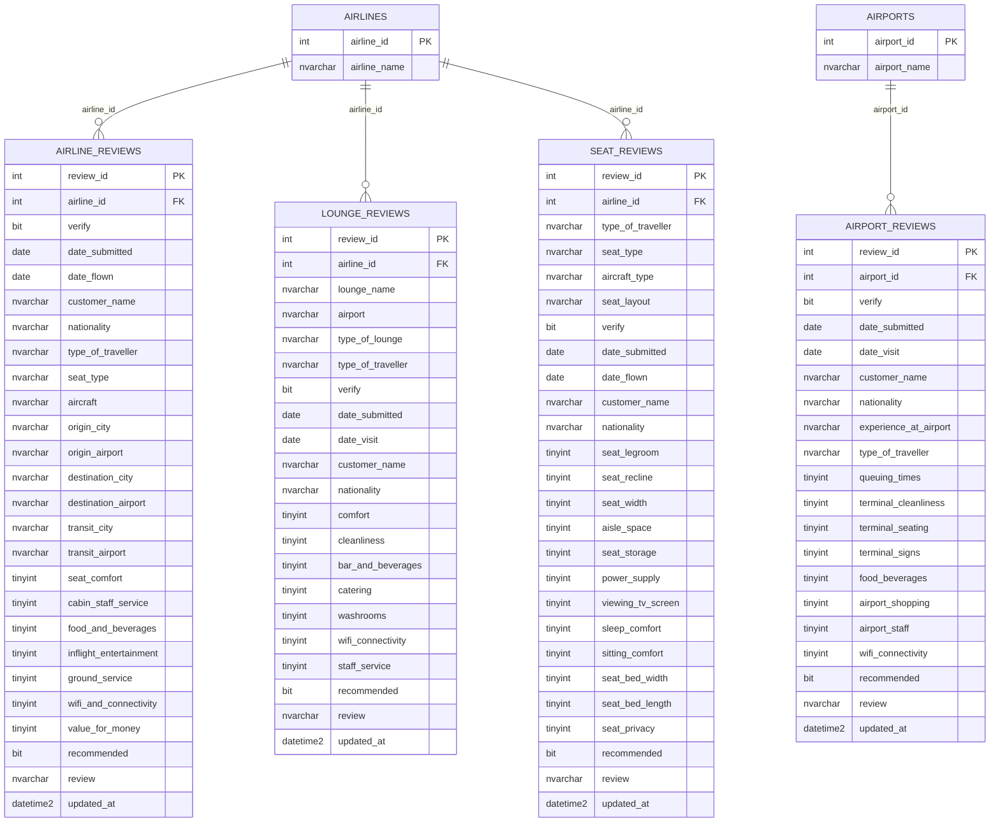

# Xóm Air Data Model

## 1. Mô hình nguồn

## 2. Quan hệ

| Bảng con | Foreign key | Bảng cha | Cardinality | Orphan |
|---|---|---|---|---:|
| `airline_reviews` | `airline_id` | `airlines.airline_id` | N:1 | 0 |
| `lounge_reviews` | `airline_id` | `airlines.airline_id` | N:1 | 0 |
| `seat_reviews` | `airline_id` | `airlines.airline_id` | N:1 | 0 |
| `airport_reviews` | `airport_id` | `airports.airport_id` | N:1 | 0 |

